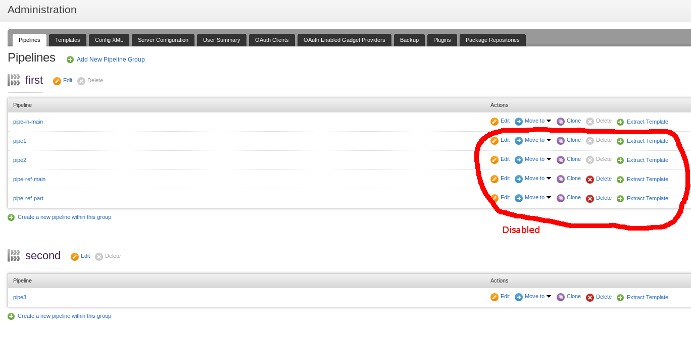
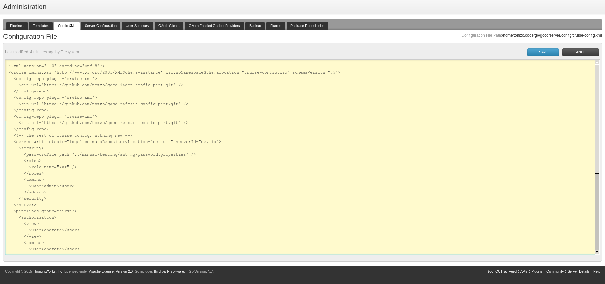

# gocd-main-config
 Dummy repository with Go's main configuration

## Active configuration

`equivalent-cruise-config.xml` is what old-style configuration would look like. While actually cruise-config.xml is used.

## Web UI

Below is expected result of Go with configuration merged from partial configs.

Pipelines would show but those defined remotely cannot be edited via UI.
Extra tab could be added where remote configuration repositories are configured.

Cruise xml still can be edited

