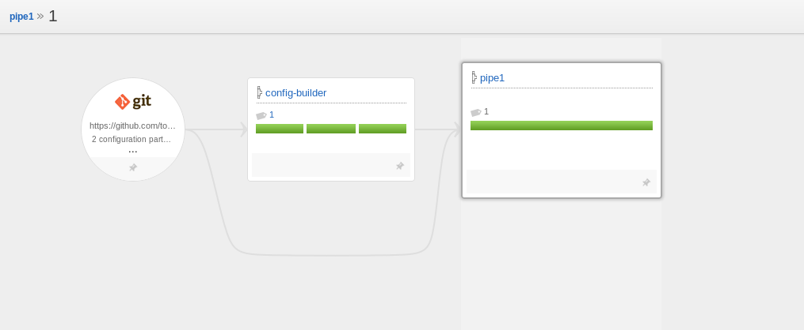
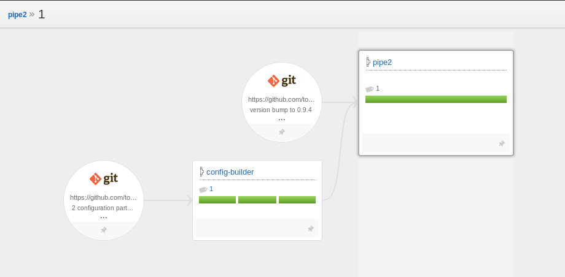

# Pipelines to build configuration

This is an example with just one configuration repository.

Pipeline `config-builder` has 3 stages:
 * parse
 * validate
 * import

Import submits configuration part to Go server.

### pipeline 1

It builds a project in repository which also contains the definition of this pipeline. So until first import in config-builder is done, there is no pipe1.

`import` stage of config-builder is a dependency material of pipe1. (Because `pipe1` config is created there)

vsm graph of pipe1:

### pipeline 2

It is defined in configuration repository A, but builds project from repository B. So this is the flexible case.

`import` stage of config-builder is a dependency material of pipe2. (Because `pipe2` config is created there)

Second dependency is a standard source code repository.

vsm graph of pipe2:

